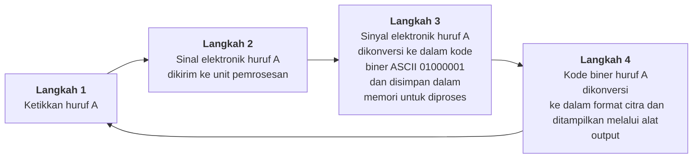

# Data Representating

Komputer menggunakan dan memanipulasi data untuk perhitungan aritmatika, pemrosesan data, dan operasi logika. Tipe data yang digunakan dalam komputer digital diklasifiasikan:

1. Data Numerik  
   merepresentasikan integer, pecahan, real, dan desimal berkode biner
2. Data Logikal  
   Digunakan oleh operasi logika seperti OR, AND, COMPLEMENT, COMPARE dan SHIFT
3. Data Bit Tunggal  
   Digunakan oleh operasi seperti SET, CLEAR, dan TEST
4. Data Alfanumerik
   Digunalan untuk memanipulasi string oleh instruksi seperti MOVE dan SEARCH

## Representasi Integer

Hanya bilangan biner yang dapat merepresentasikan bilangan integer direpresentasikan selain oleh nilai bilangannya dan tambahan tanfa (Signed Integer). Berikut tipe-tipe representasi integer:

1. Representasi Sing dan Magnitude  
    Merepresentasikan bilangan integer negatif. Bit yang paling kiri diidentifikasikan sebagai tanda (sign). Jika bit paling kiri adalah **nol** maka bilangan tersebut **positif**. Jika bit paling kiri adalah **satu** maka bilangan tersebut **negatif**.

   Contoh:
    
+1810 = 000100102

    
-1810 = 100100102

   **A. Penjumlahan** pada Sign-Magnitude mempunyai aturan:

   1. Sign tidak dijumlahan, hanya magnitude
   2. Buang carry out dari bit yang paling kiri
   3. Jumlahkan yang sign-nya sama
   4. Sign hasil = sign penambah

   Contoh penjumlahan 4 bit:

   $$
   \begin{align*}
   &\phantom{+} \text{0 0010 (2)} \\
   + &\phantom{+} \text{0 0101 (5)} \\
   \hline
   &\phantom{+} \text{0 0111 (7)} \\
   \end{align*}
   $$

   $$
   \begin{align*}
   &\phantom{+} \text{1 1011 (-11)} \\
   + &\phantom{+} \text{1 0100 (-4)} \\
   \hline
   &\phantom{+} \text{1 1111 (-15)} \\
   \end{align*}
   $$

   **B. Pengurangan** pada Sign-magnitude mempunyai aturan:

   1. Lakukan pengurangan jika sign sama
   2. Jika sign tidak sama, ubah soal ke penjumlahan

   Contoh pengurangan:

   $$
   \begin{align*}
   &\phantom{+} \text{0 10100 (20)} \\
   - &\phantom{+} \text{0 00101 (5)} \\
   \hline
   &\phantom{+} \text{0 1111 (15)} \\
   \end{align*}
   $$

   $$
   \begin{align*}
   &\phantom{+} \text{1 1011 (-11)} \\
   + &\phantom{+} \text{1 0100 (-4)} \\
   \hline
   &\phantom{+} \text{1 0111 (-7)} \\
   \end{align*}
   $$

   Kelemahan Sign-Magnitude:  
   Penambahan dan pengurangan memerlukan pertimbanggan baik tanda bilangan maupun nilai relatifnya. Ada dua representasi bilangan nol, yaitu
   
+010 = 000000002

   
-010 = 100000002

2. Representasi Komplemen Satu (One's Complement)  
   Komplemen pada dasarnya merubah bentuk pengurangan menjadi pertambahan. Komplementasi bilangan biner dengan cara mengubah 1 menjaddi 0 dan 0 menjadi 1. Contoh:
   
00110110 = 11001001

3. Representasi Komplemen Dua (Two's Complement)  
   Dibentuk dengan mengambil komplemen satu dari bilangannya dan dengan menambahkan 1 pada posisi paling kanan. Contoh desimal 49 (biner) menjadi bentuk komplemen dua:

   $$
   \begin{align*}
   &\hphantom{+} \text{110001} \\
   &\hphantom{+} \text{001110} \quad \rightarrow \text{bentuk komplemen ke-1} \\
   &\hphantom{+} \quad \quad \text{ 1} \\
   &\rule{4.3em}{.0pt} +   \\
   &\hphantom{+} \text{001111} \quad \rightarrow \text{bentuk komplemen ke-2} \\
   \end{align*}
   $$

## Penjumlahan Biner

> Under construction
